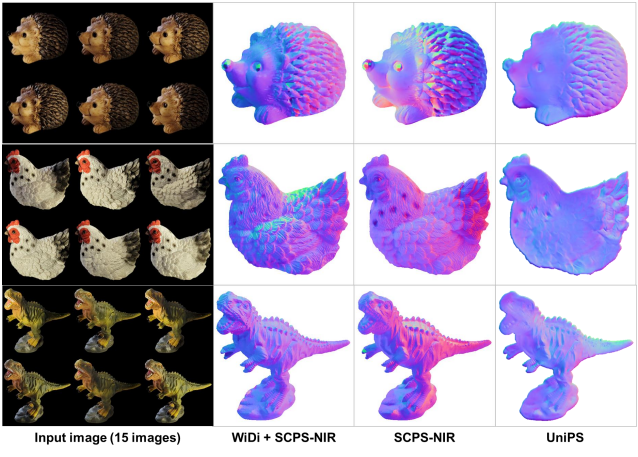
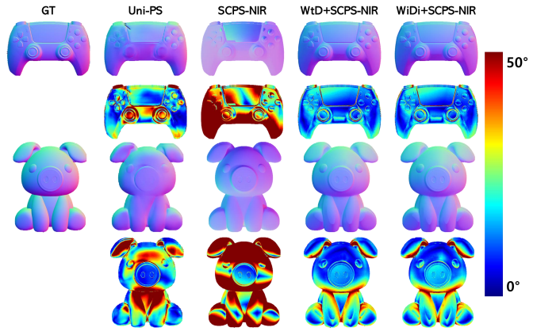

# Photometric_Stereo_Network_for_Complex_Lighting
> Sogang Univ AIE6202 project . Photometric Stereo Network for Complex Lighting

## Project Overview
This project presents an innovative approach to the challenge of uncalibrated photometric stereo in complex lighting environments. It incorporates advanced methods such as **WiDiNet (Wild-to-Directional Network)** and **SCPS-NIR (Self-Calibrating Photometric Stereo by Neural Inverse Rendering)** to enhance the accuracy of surface normal estimation under varying illumination conditions.

Photometric stereo techniques traditionally rely on controlled lighting to estimate the surface normals of objects. However, real-world applications often involve complex and uncontrolled lighting conditions. This project introduces WiDiNet and SCPS-NIR to address these challenges, offering robust performance in diverse lighting scenarios.

## Theoretical Background
The **WiDiNet** framework is designed to convert complex environmental lighting into a simplified directional lighting model, which aligns with the assumptions of traditional photometric stereo methods. On the other hand, **SCPS-NIR** utilizes an inverse rendering approach to simultaneously estimate lighting and surface normals, achieving state-of-the-art results.

## Methodology
### WiDiNet
A sophisticated network that processes wild light images to produce relighted images with the desired directional lighting effects.

<br>
*Figure 1: The overall process of WiDiNet, showcasing the conversion of wild light images into directionally lit images.*

### SCPS-NIR
A self-calibrating method that estimates both the lighting and the normals using a neural network-based inverse rendering technique.

## Key Features
- **Relighting Module**: Generates images under various directional lighting conditions.
- **WtD Module (Wild-to-Directional)**: Extracts and converts environmental lighting into directional light images.

## Full Process Structure
The full process involves capturing images under wild lighting and processing them through WiDiNet and SCPS-NIR to obtain accurate normal maps.
<
A comparison of unions of subspaces of non-activated images before
(a) and after (b) adding relighted images by the relighting module. The union of non-activated regions marked in black fully covers the
total surface in case (b). Right: environmental lighting extraction process by the WtD module. The environmental map is element-wisely
min-pooled from input wild light images. Then, the extracted environmental map is subtracted from the wild light images to generate WtD
or directional light images.


## Environment Setup
Refer to the respective GitHub repositories for environment setup instructions:
- Relighting: [IAN Repository](https://github.com/NK-CS-ZZL/IAN)
- SCPS-NIR: [SCPS-NIR Repository](https://github.com/junxuan-li/SCPS-NIR)

## Quick Test on Realwild2 main dataset
```python run.py```

## Dataset and Evaluation
The project employs various datasets to challenge and evaluate the effectiveness of the WiDiNet and SCPS-NIR methods under complex lighting conditions.

### Datasets

- **PS-WL Dataset:** Images under wild lighting to test method robustness.
- **DiLiGenT Benchmark:** Diverse materials and textures for evaluating photometric stereo methods.
- **Realwild2 Dataset[Authentically Gathered]:** Features 6 objects (ceramic, rubber, clear coat) with real-world complexity. Each object is presented in 15 detailed images, highlighting the dataset's emphasis on authentic data collection. Captured with a moving flashlight and a fixed 8-bit smartphone camera in natural indoor lighting, Realwild2 stands out for its practical, non-synthetic approach.


### Evaluation Metrics
- **Mean Angular Error (MAE)**: Measures the accuracy of the estimated normals against the ground truth.
- **Qualitative Assessment**: Provides insight into the methods' performance by visually assessing the relighted images and error maps.

<br>
*Figure 4: Qualitative results on the real dataset under wild lighting conditions.*

<br>
*Figure 5: Error maps and result visualizations for the PS-WL dataset.*

## Experimental Results
The performance of WiDiNet and SCPS-NIR was thoroughly evaluated on the PS-WL and DiLiGenT benchmarks. The results demonstrated the superiority of the proposed methods over traditional techniques.

### PS-WL Dataset Results

| 방법 | Dragon | Duck | Game | Mask | Ornament | Pig | Ring | Ring2 | 평균 MAE |
|------|--------|------|------|------|----------|-----|------|-------|----------|
| GCNet | 37.70 | 56.41 | 32.75 | 31.89 | 52.60 | 27.96 | 62.51 | 67.83 | 46.21 |
| SCPS-NIR  | 78.84 | 52.11 | 42.86 | 59.49 | 49.40 | 41.52 | 54.92 | 46.31 | 53.18 |
| UniPS  | 24.50 | 35.03 | 17.15 | 13.15 | 27.10 | 20.71 | 39.24 | 28.28 | 25.65 |
| WtD + SCPS-NIR  | 48.23 | 35.43 | 12.03 | 11.05 | 32.68 | 15.08 | 64.58 | 30.73 | 31.23 |
| WiDiNet + SCPS-NIR  | 17.91 | 34.98 | 12.10 | 7.78 | 29.63 | 15.11 | 32.34 | 29.24 | 22.39 |

### DiLiGenT Benchmark Results

| 방법 | Ball | Bear | Buddha | Cat | Cow | Goblet | Harvest | Pot1 | Pot2 | Reading | 평균 MAE |
|------|------|------|--------|-----|-----|--------|---------|------|------|---------|----------|
| SCPS-NIR  | 1.24 | 3.82 | 9.28 | 4.72 | 5.53 | 7.12 | 14.96 | 6.73 | 6.50 | 10.54 | 7.05 |
| UniPS  | 6.41 | 7.43 | 20.88 | 11.23 | 7.72 | 28.23 | 23.67 | 11.41 | 9.80 | 20.08 | 14.69 |
| WtD + SCPS-NIR  | 4.15 | 2.89 | 9.70 | 10.14 | 4.54 | 8.73 | 15.92 | 5.30 | 4.55 | 10.88 | 7.68 |
| WiDiNet + SCPS-NIR  | 0.49 | 2.19 | 9.47 | 5.02 | 4.08 | 7.25 | 14.25 | 5.99 | 3.78 | 10.09 | 6.26 |

## Discussion
The integration of WiDiNet and SCPS-NIR has shown to significantly enhance photometric stereo performance in complex lighting, proving to be effective even in challenging real-world conditions where conventional methods fail.

## Conclusion
WiDiNet and SCPS-NIR mark a significant advancement in the field of photometric stereo, offering robust and accurate normal estimation under a wide array of lighting conditions.

## Acknowledgments
Special thanks are extended to the contributors of the PS-WL and DiLiGenT datasets, which have been instrumental in advancing the photometric stereo research.

## References
TIP2022: IAN(Designing An Illumination-Aware Network for Deep Image Relighting) [Github](https://github.com/nk-cs-zzl/ian) [Paper](https://arxiv.org/abs/2207.10582) [Demos](https://github.com/nk-cs-zzl/ian#demos)<br/>
ECCV2022: SCPS-NIR(Self-calibrating Photometric Stereo by Neural Inverse Rendering) [Github](https://github.com/junxuan-li/SCPS-NIR) [Paper](https://arxiv.org/abs/2207.07815)
