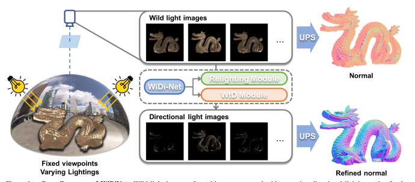

# Photometric_Stereo_Network_for_Complex_Lighting
> Sogang Univ AIE6202 project . Photometric Stereo Network for Complex Lighting

## 개요
이 프로젝트는 복잡한 조명 환경 하에서 보정되지 않은 광도 스테레오 문제를 해결하기 위한 혁신적인 접근법을 제시합니다. 
**WiDiNet (Wild-to-Directional Network)** 과 **SCPS-NIR (Self-Calibrating Photometric Stereo by Neural Inverse Rendering)** 기법을 포함하고 있습니다.

Overall Process of WiDiNet

## 이론적 배경
- ### WiDiNet
WiDiNet은 복잡한 환경 조명을 단순한 방향성 조명으로 변환하는 프로세스입니다. 이는 전통적인 보정되지 않은 광도 스테레오가 가정하는 것과 유사합니다. 환경 조명을 추출하기 위해, WiDiNet은 요소별 최소 풀링과 재조명을 사용하여 환경 맵을 생성합니다. 이 접근 방식의 주요 장점은 표면 정규 추정에서 핵심 요소인 조명을 추정할 수 있다는 것입니다.

- ### SCPS-NIR
SCPS-NIR은 역렌더링 접근 방식을 사용하여 조명과 표면 정규를 추정합니다. 이 모델은 기존의 보정되지 않은 광도 스테레오 모델과 호환되며, 복잡한 환경 조명을 처리하는데 효과적입니다.

## 주요 특징
- **재조명 모듈**: 다양한 방향성 조명 하에서 이미지를 생성합니다.
- **WtD 모듈 (Wild-to-Directional)**: 이미지에서 환경 조명을 추출하여 방향성 광원 이미지로 변환합니다.

Detailed Process of Each Module of WiDiNet

## 데이터셋과 평가
본 프로젝트는 WiDiNet과 SCPS-NIR 방법의 성능을 검증하기 위해 다양한 데이터셋을 활용합니다. 
이 데이터셋들은 복잡하고 다양한 조명 조건을 포함하여 광도 스테레오 네트워크의 강인함과 정확성을 시험합니다. 
아래는 사용된 데이터셋과 해당 평가 지표입니다:

### 데이터셋
- **PS-WL (Photometric Stereo under Wild Lighting)**: 이 데이터셋에는 제어되지 않은 다양한 조명 조건 하에서 촬영된 이미지들이 포함되어 있습니다. 전통적인 광도 스테레오 기술이 어려움을 겪는 실세계 시나리오를 모방합니다.
- **DiLiGenT**: 광도 스테레오에 대한 널리 인정받는 벤치마크로, 다양한 재료와 복잡한 기하학적 형태의 객체를 포함하고 있어 네트워크 성능을 평가하기 위한 포괄적인 실험 환경을 제공합니다.

### 평가 지표

- **평균 각도 오차 (MAE)**: MAE는 추정된 표면 정규의 정확도를 기준 정규와 비교하여 정량화합니다. 광도 스테레오의 성능을 평가하는 데 있어 중요한 척도로, 정규 벡터 추정의 정밀도를 반영합니다.
- **질적 평가**: 정량적 지표 외에도 재조명된 이미지와 오차 맵의 시각적 검토는 네트워크의 질적 성능에 대한 통찰력을 제공합니다. 특히 까다로운 조명 및 표면 조건을 다루는 능력에 대해 중요합니다.

실제 데이터셋에 대한 질적 결과

PS-WL 데이터셋에 대한 질적 결과

위에서 언급한 데이터셋과 지표들은 본 방법들이 최첨단 성능을 달성할 뿐만 아니라 
실용적인 응용에서도 높은 신뢰성을 유지하는 것을 증명하기 위한 엄격한 실험에 사용되었습니다.

## 환경 설정
각 기법에 대한 환경 설정은 아래의 GitHub 리포지토리에서 확인할 수 있습니다.
- [WiDiNet GitHub: IAN Repository](https://github.com/NK-CS-ZZL/IAN)
- [SCPS-NIR GitHub: SCPS-NIR Repository](https://github.com/junxuan-li/SCPS-NIR)

## 실험 결과
WiDiNet과 SCPS-NIR은 PS-WL 데이터셋과 DiLiGenT 벤치마크에서 뛰어난 성능을 보여주었습니다.

### PS-WL 데이터셋 결과

| 방법 | Dragon | Duck | Game | Mask | Ornament | Pig | Ring | Ring2 | 평균 MAE |
|------|--------|------|------|------|----------|-----|------|-------|----------|
| GCNet [6] | 37.70 | 56.41 | 32.75 | 31.89 | 52.60 | 27.96 | 62.51 | 67.83 | 46.21 |
| SCPS-NIR [12] | 78.84 | 52.11 | 42.86 | 59.49 | 49.40 | 41.52 | 54.92 | 46.31 | 53.18 |
| UniPS [10] | 24.50 | 35.03 | 17.15 | 13.15 | 27.10 | 20.71 | 39.24 | 28.28 | 25.65 |
| WtD + SCPS-NIR [12] | 48.23 | 35.43 | 12.03 | 11.05 | 32.68 | 15.08 | 64.58 | 30.73 | 31.23 |
| WiDiNet + SCPS-NIR [12] | 17.91 | 34.98 | 12.10 | 7.78 | 29.63 | 15.11 | 32.34 | 29.24 | 22.39 |

### DiLiGenT 벤치마크

| 방법 | Ball | Bear | Buddha | Cat | Cow | Goblet | Harvest | Pot1 | Pot2 | Reading | 평균 MAE |
|------|------|------|--------|-----|-----|--------|---------|------|------|---------|----------|
| SCPS-NIR [12] | 1.24 | 3.82 | 9.28 | 4.72 | 5.53 | 7.12 | 14.96 | 6.73 | 6.50 | 10.54 | 7.05 |
| UniPS [10] | 6.41 | 7.43 | 20.88 | 11.23 | 7.72 | 28.23 | 23.67 | 11.41 | 9.80 | 20.08 | 14.69 |
| WtD + SCPS-NIR [12] | 4.15 | 2.89 | 9.70 | 10.14 | 4.54 | 8.73 | 15.92 | 5.30 | 4.55 | 10.88 | 7.68 |
| WiDiNet + SCPS-NIR [12] | 0.49 | 2.19 | 9.47 | 5.02 | 4.08 | 7.25 | 14.25 | 5.99 | 3.78 | 10.09 | 6.26 |

이 데이터는 WiDiNet과 SCPS-NIR이 다양한 데이터셋에서 어떻게 성능을 발휘하는지 보여줍니다. 
각 행은 다른 방법들의 평균 평균 각도 오차(MAE)를 나타냅니다. 
WiDiNet + SCPS-NIR 방법이 PS-WL 데이터셋과 DiLiGenT 벤치마크에서 상당히 낮은 MAE를 기록하여 높은 성능을 입증합니다.

## 전체 프로세스 구조

참고문헌 및 추가 자료
